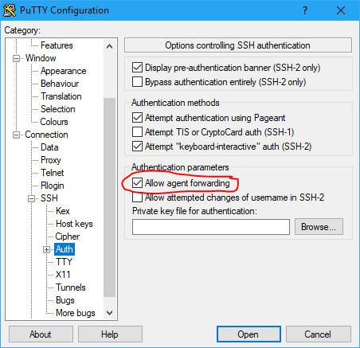
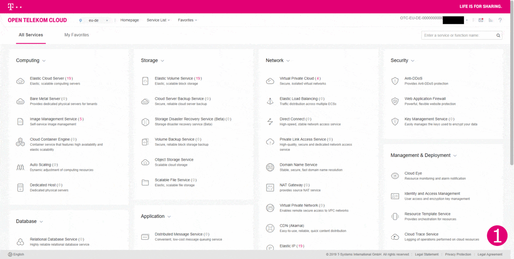
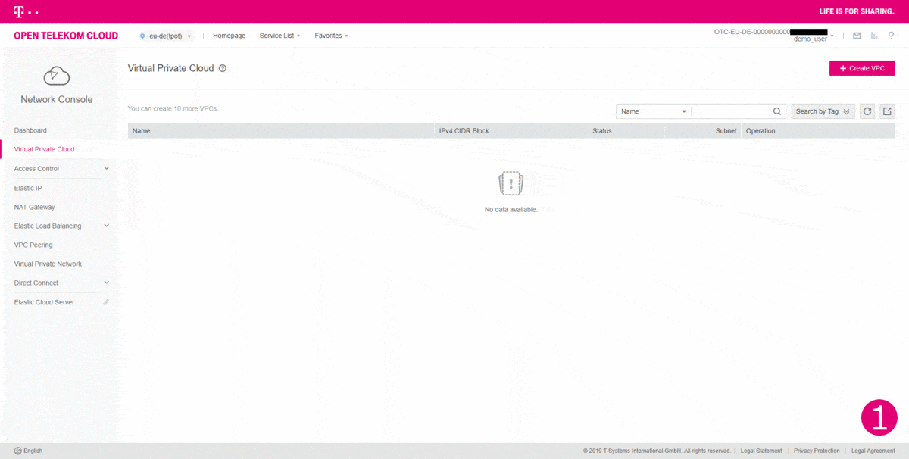

# Ansible T-Pot Deployment on Open Telekom Cloud :cloud:

Here you can find a ready-to-use solution for your automated T-Pot deployment using [Ansible](https://www.ansible.com/).  
It consists of multiple Ansible Playbooks, which can be reused across all Cloud Providers (like AWS, Azure, Digital Ocean).  
This example showcases the deployment on our own Public Cloud Offering [Open Telekom Cloud](https://open-telekom-cloud.com/en).

# Table of contents
- [Installation of Ansible Master](#installation)
  - [Packages](#packages)
  - [Agent Forwarding](#agent-forwarding)
- [Preparations in Open Telekom Cloud Console](#preparation)
  - [Create new project](#project)
  - [Create API user](#api-user)
  - [Import Key Pair](#key-pair)
  - [Create VPC, Subnet and Security Group](#vpc-subnet-securitygroup)
- [Clone Git Repository](#clone-git)
- [Settings and recommended values](#settings)
  - [Configure `.otc_env.sh`](#otc-env)
  - [Configure `.ecs_settings.sh`](#ecs-settings)
  - [Configure `tpot.conf.dist`](#tpot-conf)
  - [Optional: Custom `ews.cfg` and HPFEEDS](#ews-hpfeeds)
- [Deploying a T-Pot](#deploy)
- [Further documentation](#documentation)

<a name="installation"></a>
# Installation of Ansible Master
You can either run the deploy script locally on your Linux or MacOS machine or you can use an ECS (Elastic Cloud Server) on Open Telekom Cloud, which I did.  
I used Ubuntu 18.04 for my Ansible Master Server, but other OSes are fine too.  
Ansible works over the SSH Port, so you don't have to add any special rules to your Security Group.

<a name="packages"></a>
## Packages
At first we need to add the repository and install Ansible:  
`sudo apt-add-repository --yes --update ppa:ansible/ansible`  
`sudo apt install ansible`

Also we need **pwegen** (for creating T-Pot names) and **jq** (a JSON processor):  
`sudo apt install pwgen jq`

<a name="agent-forwarding"></a>
## Agent Forwarding
Agent forwarding must be enabled in order to let Ansible do its work.  
- On Linux or MacOS:  
  - Create or edit `~/.ssh/config`
  - If you execute the script remotely on your Ansible Master Server:
    ```
    Host ANSIBLE_MASTER_IP
    ForwardAgent yes
    ```
  - If you execute the script locally, enable it for all Hosts, as this includes newly generated T-Pots:
    ```
    Host *
    ForwardAgent yes
    ```
- On Windows using Putty:  


<a name="preparation"></a>
# Preparations in Open Telekom Cloud Console
(You can skip this if you have already set up an API account, VPC and ...)  
(Just make sure you know the naming for everything, as you will need it to configure the script.)

Before we can start deploying, we have to prepare the Open Telekom Cloud Tennant.  
For that, go to the [Web Console](https://auth.otc.t-systems.com/authui/login) and log in with an admin user.

<a name="project"></a>
## Create new project
I strongly advise you, to create a separate project for the T-Pots in your tennant.  
In my case I named it `tpot`.



<a name="api-user"></a>
## Create API user
The next step is to create a new user account, which is restricted to the project.  
This ensures that the API access is limited to that project.


<a name="key-pair"></a>
## Import Key Pair
:warning: Now log in with the newly created user account and select your project.


Import your SSH public key.


<a name="vpc-subnet-securitygroup"></a>
## Create VPC, Subnet and Security Group
- VPC (Virtual Private Cloud) and Subnet:



- Security Group:  
The configured Security Group should allow all incoming TCP / UDP traffic.  
If you want to secure the management interfaces, you can limit the incoming "allow all" traffic to the port range of 1-64000 and allow access to ports > 64000 only from your trusted IPs.


<a name="clone-git"></a>
# Clone Git Repository
Clone the `tpotce` repository to your Ansible Master:  
`git clone https://github.com/dtag-dev-sec/tpotce.git`  
All Ansible and automatic deployment related files are located in the [`cloud/open-telekom-cloud`](../../cloud/open-telekom-cloud) folder.

<a name="settings"></a>
# Settings and recommended values
You can configure all aspects of your ECS and T-Pot before using the script.  
The settings are located in the following files:

<a name="otc-env"></a>
## Configure `.otc_env.sh`
Enter your Open Telekom Cloud API user credentials here (username, password, tennant-ID, project name):  
```
export OS_USERNAME=your_api_user
export OS_PASSWORD=your_password
export OS_USER_DOMAIN_NAME=OTC-EU-DE-000000000010000XXXXX
export OS_PROJECT_NAME=eu-de_your_project
export OS_AUTH_URL=https://iam.eu-de.otc.t-systems.com/v3
```

<a name="ecs-settings"></a>
## Configure `.ecs_settings.sh`
Here you can customize your Elastic Cloud Server (ECS):
  - Password for the user `linux` (**you should definitely change that**)  
    You may have to adjust the `remote_user` in the Ansible Playbooks under [ansible](ansible) if you are using a normal/default Debian base image
  - (Optional) For using a custom `ews.cfg` set to `true`; See here: [Optional: Custom `ews.cfg`](#ews-cfg)
  - (Optional) Change the instance type (flavor) of the ECS.  
    `s2.medium.8` corresponds to 1 vCPU and 8GB of RAM and is the minimum required flavor.  
    A full list of flavors can be found [here](https://docs.otc.t-systems.com/en-us/usermanual/ecs/en-us_topic_0035470096.html).
  - Change the OS (Don't touch; for T-Pot we need Debian 9)
  - Specify the VPC, Subnet, Security Group and Key Pair you created before
  - (Optional) Change the disk size
  - You can choose from multiple Availibility Zones (AZ). For reference see [here](https://docs.otc.t-systems.com/en-us/endpoint/index.html).

```
# Set password for user linux
linuxpass=LiNuXuSeRPaSs#

# Custom EWS config
custom_ews=false

# Set ECS related stuff
instance=s2.medium.8
imagename=Standard_Debian_9_latest
subnet=your-subnet
vpcname=your-vpc
secgroup=your-sg
keyname=your-KeyPair
disksize=128
az=eu-de-03
```

<a name="tpot-conf"></a>
## Configure `tpot.conf.dist`
The file is located in [`iso/installer/tpot.conf.dist`](../../iso/installer/tpot.conf.dist).  
Here you can choose:
  - between the various T-Pot editions
  - a username for the web interface
  - a password for the web interface (**you should definitely change that**)

```
# tpot configuration file
# myCONF_TPOT_FLAVOR=[STANDARD, SENSOR, INDUSTRIAL, COLLECTOR, NEXTGEN, LEGACY]
myCONF_TPOT_FLAVOR='STANDARD'
myCONF_WEB_USER='webuser'
myCONF_WEB_PW='w3b$ecret'
```

<a name="ews-hpfeeds"></a>
## Optional: Custom `ews.cfg` and HPFEEDS
To enable these features, set `custom_ews=true` in `.ecs_settings.sh`; See here:  [Configure `.ecs_settings.sh`](#ecs-settings)  

### ews.cfg
You can use a custom config file for `ewsposter`.  
e.g. when you have your own credentials for delivering data to our [Sicherheitstacho](https://sicherheitstacho.eu/start/main).  
You can find the `ews.cfg` template file here: [`ansible/roles/custom_ews/templates/ews.cfg`](ansible/roles/custom_ews/templates/ews.cfg) and adapt it for your needs.

For setting custom credentials, these settings would be relevant for you (the rest of the file can stay as is):  
```
[MAIN]
...
contact = your_email_address
...

[EWS]
...
username = your_username
token = your_token
...
```

### HPFEEDS
You can also specify HPFEEDS in [`ansible/roles/custom_ews/templates/hpfeeds.cfg`](ansible/roles/custom_ews/templates/hpfeeds.cfg).  
That file constains the defaults (turned off) and you can adapt it for your needs, e.g. for SISSDEN:
```
myENABLE=true
myHOST=hpfeeds.sissden.eu
myPORT=10000
myCHANNEL=t-pot.events
myCERT=/opt/ewsposter/sissden.pem
myIDENT=your_user
mySECRET=your_secret
myFORMAT=json
```


<a name="deploy"></a>
# Deploying a T-Pot :honey_pot::honeybee:
Now, after configuring everything, we can finally start deploying T-Pots:  
`./deploy_ansible_otc_t-pot.sh`  
(Yes, it is as easy as that :smile:)

The script will first create an Open Telekom Cloud ECS via the API.  
After that, the Ansible Playbooks are executed on the newly created Host to install the T-Pot and configure everything.

You can see the progress of every step in the console output.  
If something should go wrong, you will be provided with an according error message, that you can hopefully act upon and retry.

<a name="documentation"></a>
# Further documentation
- [Ansible Documentation](https://docs.ansible.com/ansible/latest/)
- [Open Telekom Cloud Help Center](https://docs.otc.t-systems.com/)
- [Open Telekom Cloud API Overview](https://docs.otc.t-systems.com/en-us/api/wp/en-us_topic_0052070394.html)
- [otc-tools](https://github.com/OpenTelekomCloud/otc-tools) on GitHub
